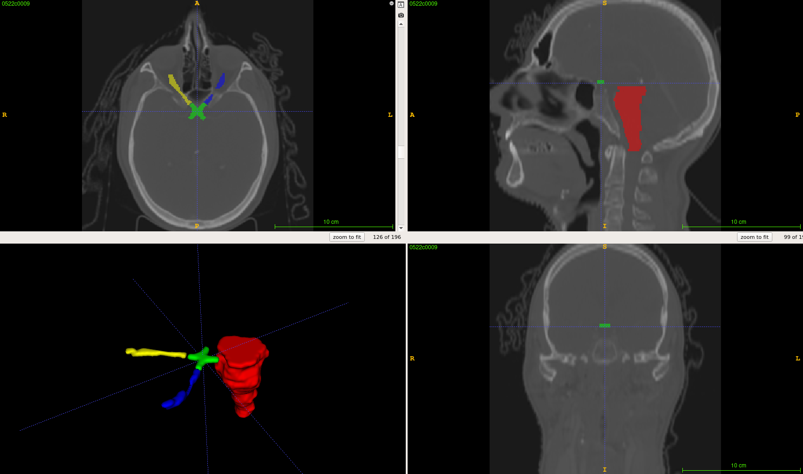

# 4 OARs Segmentation on CT H&N Data

## Prepare dataset

The data pipeline before the model require the data been converted to NIfTI format.
The following example show how to convert the PDDCA like dataset to meet the requirement.

### File hierarchy

Users need to provide the PDDCA like structure so that the script can handle it.
Since the model aims to the segmentation on *brainstem*, *optic chiasm*, *bilateral optic nerves*,
there must be corresponding files with the keyword name _Brainstem_, _Chiasm_, _OpticNerve\_L_, _OpticNerve\_R_
inside the data folder.

```bash
data                             // data folder
├── 0522c0555                    // case name
│   ├── img.nrrd                 // image file (NRRD)
│   └── structures               // structures to segment
│       ├── Brainstem.nrrd
│       ├── Chiasm.nrrd
│       ├── OpticNerve_L.nrrd
│       ├── OpticNerve_R.nrrd
```

### Prerequisite

Please install the required library so that you can run the following scripts
to preprocess the dataset.

```bash
pip install -r requirements.txt
```


### Step 1: Convert NRRD to NIfTI

Since the model was trained on ABCs dataset, we need to resample the image to the spacing of 1.2 mm.
Assume the folder containing the data wanted to process is named _data_.
Run the following script can process all data inside the folder. You may wait a moment sine the resampling
on images may take some time.

> Run

```bash
./nrrd2nifti.py --data-dir data --output-dir nifti
```

> Log

```txt
100%|███████████████████████████████████████████████████| 2/2 [00:31<00:00, 15.64s/it]
Ouputs have been stored in nifti.
```

The following steps are optional, which are used to speed up the testing and development.
One may directly run the inference and check there're some faults on the area outside the
region of interest.

### Step 2 (optional): Find the bounding boxes

Since the raw images usually contains lots of background, we can find the bounding boxes of enclosing
the labels and speed up the development.

> Run

```bash
./find_bbox.py --data-dir nifti
```

> Log

```txt
Box size
        x: 88.00 ± 2.00
        y: 107.00 ± 0.00
        z: 101.00 ± 6.00

The list of bounding boxes have been stored into ./bbox.json.
```

### Step 3 (optional): Crop the data

We chose (196, 196, 196) as the default crop size for the PDDCA, which is small enough for the inference efficiency and
large enough to cover the whole head.
Although this might cheat a little bit, you can still use the size of each box to find the most fitting one by setting the crop_size to (0, 0, 0).

> Run

```bash
./crop_data.py --data-dir nifti --crop-size 196 196 196 --output-dir cropped
```

> Log

```txt
Use the crop_size: (196, 196, 196)
100%|███████████████████████████████████████████████████| 2/2 [00:01<00:00,  1.07it/s]
```

Here are some views of the cropped data.




## Run the inference

Move to the directory _infer_ and follow the steps below to run the inference.

### Download pretrained model

> Run

```bash
make download_model
```

> Log

```bash
ckpts.tar.gz            [               <=> ]  20.89M  2.40MB/s    in 9.8s

2020-12-09 10:48:30 (2.12 MB/s) - ‘ckpts.tar.gz’ saved [21909602]

ckpts/
ckpts/mod_enc.pt
ckpts/mod_seg.pt
```

### Set the data list

Before running, we need to specify which cases to infer.
For example, we assume the data containing the NIfTI images are
in the parent folder of the current path and named _nifti_.
And create a _data\_list.json5_ to specify the data loading.

```json5
{
  "amount": 2,
  "list": [                             // Set some cases to be segmented
    "0522c0555",
    "0522c0576",
  ],
  "loader": {
    "image_dir": "../nifti/images",      // Set the image folder
    "label_dir": "../nifti/labels",     // Set the label folder
    "name": "MSDLoader",
    "roi_map": {
      "Brainstem": 1,
      "Chiasm": 2,
      "OpticNerve_L": 3,
      "OpticNerve_R": 4,
    },
  },
}
```

### Start inference

> Run

```bash
make infer
```
> Log

```txt
===== Inferring... =====
===== Loading checkpoint ./ckpts/mod_enc.pt =====
===== Loading checkpoint ./ckpts/mod_seg.pt =====
[Inferring]: 100%|█████████████████████████████████████████████████████████████████████████████████████████████████████████████████████████████████████████████| 33/33 [01:59<00:00,  3.63s/it]
[0522c0576] : 100%|█████████████████████████████████████████████████████████████████████████████████████████████████████████████████████████████████████████████| 2/2 [04:39<00:00, 139.88s/it]
Time: 416.34584951400757
```

### Evaluate the performance

Go back to the previous folder and then run the below script to compute the Dice Similarity Coefficient(DSC) between
the ground truth and the model's prediction.

> Run

```bash
./compute_dice.py --ground-truth ./nifti/labels --prediction ./infer/outputs
```

> Log

```txt
Brainstem: 0.782
Optic Chiasm: 0.356
Left Optic Nerve: 0.647
Right Optic Nerve: 0.534
Average: 0.580

Case average: [0.59559641 0.56397002]
```
