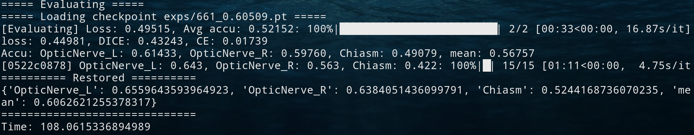
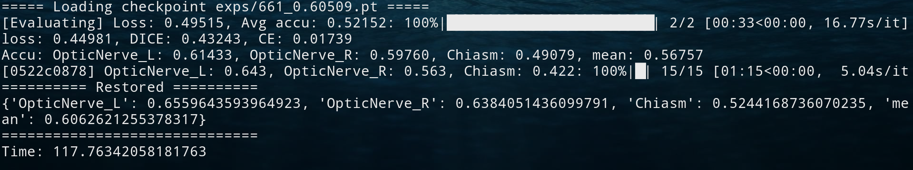

= Visual System Segmentation with Bounding Box
:toc: left
:icons: font
:source-highlighter: rouge
:rouge-style: thankful_eyes
:sectnums:
:sectlinks:
:sectanchors:

This document states how to use the example `MIS/deployments/visual-system-bbox`.

== Prerequisites

=== Prepare dataset

Place your dataset folder in here(_MIS/deployments/visual-system-bbox_) and name it as `data`. +
Or you may directly create a link to the folder like this.

    ln -s YOUR_DATASET data

=== Update the MIS & MIDP packages

* Update MIS

    cd PATH_OF_MIS
    git pull

* Update MIDP

    pip install -U git+https://github.com/YuanYuYuan/MIDP

=== Set the data list

==== For training/validation, please modify _training/data_list.yaml_.

[source, yaml]
----
amount:
  test: 11
  total: 48
  train: 28
  valid: 9
list:                   // <1>
  train:
  - 0522c0002
      ⋮
  valid:
  - 0522c0001
      ⋮
loader:
  data_dir: ../data
  name: NRRDLoader
  roi_map:
    OpticNerve_L: 1
    OpticNerve_R: 2
    Chiasm: 3
  spacing: 1
  resample: false      // <2>
----
<1> Fill in the data list to be evaluated with the name of each case.
<2> The default spacing of this model is 1mm. If your dataset hasn't been resampled into this spacing,
you may toggle this option. However, for the training efficiency, #the recommended way is to preprocess
the dataset with https://yuanyuyuan.github.io/MIDP/usage.html#_resample_the_nrrd_into_consistent_spacing[this]#.

For evaluation, please modify _evaluation/data_list.yaml_.

[source, yaml]
----
list:
- 0522c0001            // <1>
    ⋮
loader:
  data_dir: ../data
  name: NRRDLoader
  roi_map:
    OpticNerve_L: 1
    OpticNerve_R: 2
    Chiasm: 3
  spacing: 1
  resample: false      // <2>
----
<1> Fill in the data list to be evaluated with the name of each case.
<2> The default spacing of this model is 1mm. If your dataset hasn't been resampled into this spacing,
you may toggle this option. However, for the training efficiency, #the recommended way is to preprocess
the dataset with https://yuanyuyuan.github.io/MIDP/usage.html#_resample_the_nrrd_into_consistent_spacing[this].#

[TIP]
Note that you can split the dataset to training/validation/testing three parts.
Train the model on training data, choose the best model in checkpoints
according to the performance on the validation data, and finally evaluate the
performance on the testing data.

[TIP]
You can use the tools from MIDP to generate the data list.
Please see https://yuanyuyuan.github.io/MIDP/usage#_generate_data_list_for_training[here] for the details.

== Usage

=== Download the trained model

    make download_model

It will download a model checkpoint which achieved the performance as below.

.Validation performance on PDDCA dataset 1mm with center_crop: 256, stride size: 48
[options="header", frame="none"]
|===
| Left Optic Nerve | Right Optic Nerve | Chiasm | Average

| 0.6560
| 0.6384
| 0.5244
| 0.6063

|===

=== Determine the bounding boxes(ROIs, mask of the visual system)

For the usage, please refer to
https://yuanyuyuan.github.io/MIDP/usage#_find_bounding_boxes[here].
After that, please copy the `bbox.json` to here.

=== Evaluation

Directly evaluate the performance with the trained model checkpoint.

    make evaluate

Or evaluate the performance with a newly trained checkpoint.

    make evaluate CKPT=training/_ckpts/SOME_BETTER_CHECKPOINT

.Evaluating

[TIP]
One can observe the gap between the score of each batch(before reconstruction)
and the evaluation one(after reconstruction,
true dice score enclosed in *===== Restored =====*). +
Since there are additional processings like applying threshold
, averaging the overlapping predictions, the performance will be
better.

The output result will be exported as _evaluation/score.json_.

.[Result]
[%collapsible]
====
.score.json
[source, json]
----
include::score.json[]
----
====

Besides making inference, save the predictions and store them into NRRD.

    make predict

.Predicting

The outputs will be stored in the folder _evaluation/outputs_.

[NOTE]
The process may be slow due to resampling twice before/after inference.
And the current workflow will store the predictions of all cases
and then do reconstruction, the memory usage might be large.

=== Training

Continue training with the trained model.

    make train

[NOTE]
There will be a gap between the validation score and the evaluation one since
the condition is harder(the model makes prediction without considering threshold).

[NOTE]
If you want to use some model checkpoints to resume training, please specify the checkpoint path in the training config.

.training/training.yaml
[source, yaml]
----
⋮
models:
  seg:
    model_config: '../models/seg_vae_reg.json5'
    checkpoint: '../model_checkpoint.pt' <1>
  dis:
    model_config: '../models/dis.json5'
    # checkpoint: 'dis.pt'
⋮
----
<1> Modify here.
