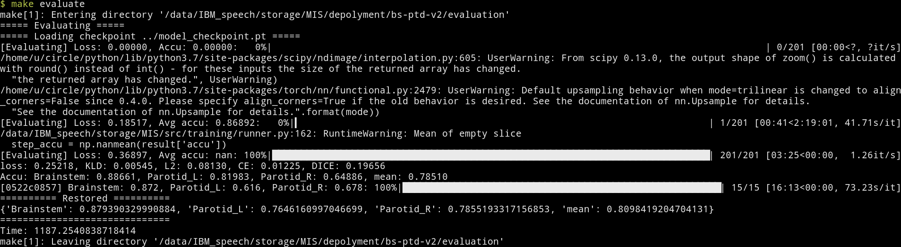

= Brainstem & Parotids Segmentation V2
:toc: left
:icons: font
:source-highlighter: rouge
:rouge-style: thankful_eyes
:sectnums:
:sectlinks:
:sectanchors:

This document states how to use the example `MIS/depolyment/ps-ptd-v2`.

== Prerequisites

=== Prepare dataset

Place your dataset folder in here(_MIS/depolyment/ps-ptd-v2_) and name it as `data`. +
Or you may directly create a link to the folder like this.

    ln -s YOUR_DATASET data

=== Set the data list

==== For training/validation, please modify _training/data_list.yaml_.

[source, yaml]
----
amount:
  test: 0
  total: 48
  train: 33
  valid: 15
list:                   // <1>
  train:
  - 0522c0001
      ⋮
  valid:
  - 0522c0002
      ⋮
loader:
  name: NRRDLoader
  data_dir: ../data
  roi_map:
    Brainstem: 1
    Parotid_L: 2
    Parotid_R: 3
  spacing: 1
  resample: true        // <2>
----
<1> Fill in the training/validation data list with the name of each case.
<2> If you're going to run the model on a dataset that has already been resampled, you may toggle off the `resample`. +
    This way should accelerate the training.

For evaluation, please modify _evaluation/data_list.yaml_.

[source, yaml]
----
list:
- 0522c0002            // <1>
    ⋮
loader:
  name: NRRDLoader
  data_dir: ../data
  roi_map:
    Brainstem: 1
    Parotid_L: 2
    Parotid_R: 3
  spacing: 1
  resample: true        // <2>
----
<1> Fill in the data list to be evaluated with the name of each case.
<2> If you're going to run the model on a dataset that has already been resampled, you may toggle off the `resample`. +
    This way should accelerate the evaluation.

[TIP]
Note that you can split the dataset to training/validation/testing three parts.
Train the model on training data, choose the best model in checkpoints
according to the performance on the validation data, and finally evaluate the
performance on the testing data.

[TIP]
You can use the tools from MIDP to generate the data list.
Please see https://yuanyuyuan.github.io/MIDP/usage#_generate_data_list_for_training[here] for the details.

== Usage

=== Download the trained model

    make download_model

It will download a model checkpoint which achieved the performance as below.

.Validation performance on PDDCA dataset
[options="header", frame="none"]
|===
| Brainstem | Left Parotid | Right Parotid | Average

| 0.879390329990884
| 0.7646160997046699
| 0.7855193317156853
| 0.8098419204704131
|===

=== Training

Continue training with the trained model.

    make train

.Training

[NOTE]
The dice score here is computed with `smooth=1`(Laplacian smooth),
which means the performance may be *overestimated*.
But since this is early model trained with dice loss
with `smooth=1`, and the checkpoint is selected according
to the validation dice score with `smooth=1`,
so we uses Laplacian smooth here the metrics here.

[NOTE]
There will be a gap between the validation score and the evaluation one since
the condition is harder(the model makes prediction without considering threshold).

=== Evaluation

Directly evaluate the performance with the trained model checkpoint.

    make evaluate

Evaluate the performance with a newly trained checkpoint.

    make evaluate CKPT=training/_ckpts/SOME_BETTER_CHECKPOINT

.Evaluating

[TIP]
One can observe the gap between the score of each batch(before reconstruction)
and the evaluation one(after reconstruction,
true dice score enclosed in *===== Restored =====*). +
Since there are additional processings like applying threshold
, averaging the overlapping predictions, the performance will be
better.

The output result will be exported as _evaluation/score.json_.

.[Result]
[%collapsible]
====
.score.json
[source, json]
----
include::score.json[]
----
====

Besides making inference, save the predictions and store them into NRRD.

    make predict

.Predicting

The outputs will be stored in the folder _evaluation/outputs_.

[NOTE]
The process may be slow due to resampling twice before/after inference.
And the current workflow will store the predictions of all cases
and then do reconstruction, the memory usage might be large.

